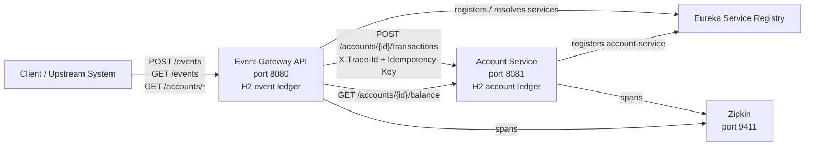
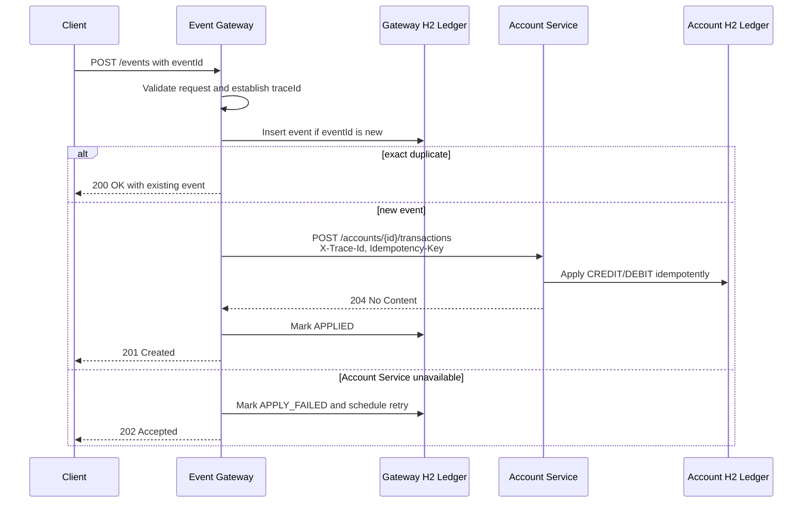

# Event Gateway API

Spring Boot Event Gateway API for a financial Event Ledger system.

The gateway accepts transaction events from upstream systems, stores each event
idempotently, and synchronously calls an internal Account Service to apply the
transaction. Events remain queryable even when Account Service is unavailable.

## Architecture Overview

Event Gateway is the public ingestion boundary. It owns event receipt,
idempotency, validation, event ordering for listings, trace propagation, and
resilient calls to Account Service. Account Service owns account transaction
application and balance computation. Each service has its own embedded H2
database and can run independently.





### Design Choices

- Event Gateway stores events before calling Account Service so inbound events are not lost during downstream outages.
- Account Service computes balances from its own ledger so balance logic stays in the account domain and Gateway remains an ingestion/proxy boundary.
- Both services use separate in-memory H2 databases to make service separation explicit and runnable without external database setup.
- `eventId` is used as the Gateway idempotency key and as the Account Service `Idempotency-Key` header, which makes retries safe.
- Event listings sort by `eventTimestamp`, not arrival time, so out-of-order delivery does not affect read behavior.
- Gateway uses Resilience4j circuit breaker and bulkhead around Account Service calls. The circuit breaker stops repeated downstream failures from consuming request capacity; the bulkhead caps concurrent downstream calls so Account Service slowness does not exhaust Gateway resources.
- Gateway returns `202 Accepted` for unavailable Account Service during `POST /events` because the event has been durably stored and can be retried later. Balance read-through calls return `503` because they depend directly on live Account Service data.
- `X-Trace-Id` is propagated over HTTP and written into structured logs in both services so a single client request can be followed across service boundaries.

## Baseline Stack

- Java 21
- Spring Boot 4.0.6
- Spring Cloud 2025.1.1 with Netflix Eureka client
- Zipkin tracing through Spring Boot Actuator and Micrometer tracing
- Docker deployment
- Lombok
- Apache Commons Collections
- Resilience4j circuit breaker and bulkhead
- H2 in-memory database

## API

- `POST /events` submits a transaction event.
- `GET /events/{id}` retrieves one event by event id.
- `GET /events?account={accountId}` lists events for an account ordered by original event timestamp.
- `GET /accounts/{accountId}/balance` proxies an Account Service balance lookup.
- `GET /accounts/{accountId}` proxies Account Service account details and recent transactions.
- `GET /health` returns the public gateway health response.
- `GET /actuator/health` returns runtime health details.
- `GET /h2-console` opens the development H2 console.

### Event Submission

```json
{
  "eventId": "9b63f0d4-0f49-4f85-9447-fd45a0c5b3c2",
  "accountId": "acct-123",
  "type": "CREDIT",
  "amount": 150.00,
  "currency": "USD",
  "eventTimestamp": "2026-05-15T14:02:11Z",
  "metadata": {
    "source": "mainframe-batch",
    "batchId": "B-9042"
  }
}
```

Submission behavior:

- New event applied successfully: `201 Created`, status `APPLIED`.
- Exact duplicate `eventId` and payload: `200 OK`, `duplicate=true`, transaction is not re-applied.
- Same `eventId` with different payload: `409 Conflict`.
- Account Service unavailable: event is stored, `202 Accepted`, status `APPLY_FAILED`.
- Account Service rejects the transaction with a non-retryable client error: event is stored, `202 Accepted`, status `APPLY_REJECTED`.
- Retryable Account Service apply failures are retried by a scheduled gateway worker with backoff.
- Account event listing is ordered by `eventTimestamp`, not arrival order.

### Account Read-Through

The gateway is the external boundary for Account Service reads. These endpoints
call Account Service internally and return the downstream response body and HTTP
status to the caller.

- `GET /accounts/{accountId}/balance`: current account balance.
- `GET /accounts/{accountId}`: account details and recent transactions.

If Account Service is unavailable, the gateway returns `503 Service Unavailable`
with code `ACCOUNT_SERVICE_UNAVAILABLE`.

### Response Envelope

Successful Event Gateway responses use a standard envelope:

```json
{
  "timestamp": "2026-06-06T21:00:00Z",
  "status": 201,
  "code": "EVENT_CREATED",
  "description": "Event was stored and applied to the account.",
  "data": {
    "eventId": "9b63f0d4-0f49-4f85-9447-fd45a0c5b3c2",
    "accountId": "acct-123",
    "status": "APPLIED"
  }
}
```

Error responses use a standard error envelope:

```json
{
  "timestamp": "2026-06-06T21:00:00Z",
  "status": 409,
  "code": "DUPLICATE_EVENT_CONFLICT",
  "description": "Event id already exists with a different payload: 9b63f0d4-0f49-4f85-9447-fd45a0c5b3c2",
  "details": []
}
```

Primary event response codes:

- `EVENT_CREATED`: event was stored and applied.
- `EVENT_DUPLICATE`: exact duplicate event was ignored and existing event returned.
- `EVENT_ACCEPTED_ACCOUNT_APPLY_FAILED`: event was stored but Account Service apply failed.
- `EVENT_ACCEPTED_ACCOUNT_APPLY_REJECTED`: event was stored but Account Service rejected the transaction.
- `EVENT_RETRIEVED`: event lookup succeeded.
- `EVENTS_LISTED`: account event list succeeded.
- `HEALTH_OK`: public health check succeeded.

Primary error codes:

- `VALIDATION_ERROR`: request validation failed.
- `MALFORMED_REQUEST`: request body could not be parsed or has invalid field values.
- `EVENT_NOT_FOUND`: requested event id does not exist.
- `DUPLICATE_EVENT_CONFLICT`: event id already exists with a different payload.
- `ACCOUNT_SERVICE_UNAVAILABLE`: Account Service could not be reached for a read-through request.
- `INTERNAL_SERVER_ERROR`: unexpected server-side failure.

## Setup and Startup

Prerequisites:

- Java 21 JDK
- Maven 3.9+
- Docker Desktop, only if using the per-service Docker Compose files
- A Eureka-compatible service registry running on `http://localhost:8761`
- Optional Zipkin on `http://localhost:9411` for trace visualization

Recommended local startup order:

1. Start the service registry first. Both services are Eureka clients and use the registry for discovery.
2. Start Event Gateway second. Gateway can start before Account Service because it has a fallback Account Service URL and degrades safely when Account Service is unavailable.
3. Start Account Service third. Once it registers as `account-service`, Gateway can discover it through Eureka; until then Gateway uses `ACCOUNT_SERVICE_DEFAULT_URL`.

Manual startup from separate terminals:

```powershell
# Terminal 1: service registry
# Start your Eureka server so it is available at http://localhost:8761
```

```powershell
# Terminal 2: Event Gateway
cd C:\Users\pravi\IdeaProjects\EventGatewayService\EventGatewayService
$env:JAVA_HOME = "C:\Program Files\Java\jdk-21.0.11"
$env:Path = "$env:JAVA_HOME\bin;$env:Path"
$env:EUREKA_DEFAULT_ZONE = "http://localhost:8761/eureka/"
$env:ACCOUNT_SERVICE_DEFAULT_URL = "http://localhost:8081"
mvn spring-boot:run
```

```powershell
# Terminal 3: Account Service
cd C:\Users\pravi\IdeaProjects\EventGatewayService\AccountSvc
$env:JAVA_HOME = "C:\Program Files\Java\jdk-21.0.11"
$env:Path = "$env:JAVA_HOME\bin;$env:Path"
$env:EUREKA_DEFAULT_ZONE = "http://localhost:8761/eureka/"
mvn spring-boot:run
```

Health checks:

- Event Gateway: `GET http://localhost:8080/health`
- Account Service: `GET http://localhost:8081/health`
- Eureka: `GET http://localhost:8761`

## Service Discovery

This service is configured as a Eureka client. On startup it registers itself
with the Eureka registry using `spring.application.name`, which defaults to
`event-gateway-api`.

Default Eureka registry URL:

```powershell
$env:EUREKA_DEFAULT_ZONE = "http://localhost:8761/eureka/"
```

Useful Eureka environment overrides:

```powershell
$env:EUREKA_CLIENT_ENABLED = "true"
$env:EUREKA_REGISTER_WITH_EUREKA = "true"
$env:EUREKA_FETCH_REGISTRY = "true"
$env:EUREKA_INSTANCE_PREFER_IP_ADDRESS = "true"
```

The gateway resolves Account Service from Eureka before calling:

- `POST /accounts/{accountId}/transactions`
- `GET /accounts/{accountId}/balance`
- `GET /accounts/{accountId}`

Default Account Service registry id:

```powershell
$env:ACCOUNT_SERVICE_SERVICE_ID = "account-service"
```

Default Account Service fallback URL:

```powershell
$env:ACCOUNT_SERVICE_DEFAULT_URL = "http://localhost:8081"
```

Account Service timeout overrides:

```powershell
$env:ACCOUNT_SERVICE_CONNECT_TIMEOUT = "2s"
$env:ACCOUNT_SERVICE_READ_TIMEOUT = "5s"
```


### Account Service POC Internal Access

Event Gateway sends shared POC internal-access headers on every Account Service call so Account Service can reject direct calls that do not look like Event Gateway traffic.

```powershell
$env:ACCOUNT_SERVICE_INTERNAL_CALLER_HEADER = "X-Internal-Caller"
$env:ACCOUNT_SERVICE_INTERNAL_TOKEN_HEADER = "X-Internal-Token"
$env:ACCOUNT_SERVICE_INTERNAL_CALLER = "event-gateway-api"
$env:ACCOUNT_SERVICE_INTERNAL_TOKEN = "local-dev-token"
```

These headers are a POC convenience only. Production should use network policy, mTLS, OAuth2 client credentials, or service mesh identity.

Failed apply retry overrides:

```powershell
$env:EVENT_GATEWAY_RETRY_ENABLED = "true"
$env:EVENT_GATEWAY_RETRY_FIXED_DELAY = "30s"
$env:EVENT_GATEWAY_RETRY_INITIAL_DELAY = "30s"
```

The Account Service should register with Eureka using the same service id. The
gateway uses Eureka only to resolve the Account Service base URL; the concrete
endpoint path is built by the Account Service client. If Eureka is unavailable
or has no healthy `account-service` instance, the gateway uses
`ACCOUNT_SERVICE_DEFAULT_URL`. If the fallback URL is also unavailable, the
gateway still persists the event and returns `202 Accepted` with status
`APPLY_FAILED`. Apply calls include the event id as an `Idempotency-Key` header
so Account Service can safely deduplicate gateway retries. Gateway also sends
`X-Trace-Id` so one external request can be correlated across Gateway and
Account Service logs.

## Structured Logging

Console logs are emitted as JSON using Spring Boot structured Logstash format.
Each log line includes `timestamp`, `level`, `serviceName`, `traceId`, `spanId`,
`logger`, `thread`, and `message`.

`serviceName` is populated from `spring.application.name`. `traceId` and
`spanId` are populated from the tracing MDC when available; outside a traced
request they are emitted as empty strings so downstream log queries can rely on
stable fields.

`GET /health` returns the public health envelope with basic diagnostics,
including database connectivity. Actuator metrics are exposed under
`/actuator/metrics`; event submissions increment the custom
`event_gateway.events.submitted` counter tagged by apply status and duplicate
flag.

## Automated Tests

All Gateway tests run with the standard Maven test lifecycle:

```powershell
mvn clean test
```

The suite includes:

- Core event functionality: idempotency, duplicate conflict handling, out-of-order event listing, CREDIT/DEBIT forwarding, and validation failures.
- Resiliency behavior: Account Service apply failure, durable `APPLY_FAILED` handling, retry backoff, and circuit breaker open behavior.
- Trace propagation: inbound `X-Trace-Id` handling, response echoing, and outbound Account Service header propagation.
- Observability: health response diagnostics and custom event submission metrics.
- Contract tests: Pact consumer tests for Account Service apply, rejection, balance read, and account-not-found behavior.
- Full Gateway-to-Account-Service HTTP flow: `GatewayAccountServiceFlowIntegrationTest` starts Gateway on a random port and an embedded contract-faithful Account Service HTTP server, submits CREDIT and DEBIT events, verifies idempotent duplicate handling, then reads the computed balance through Gateway.
- Cucumber acceptance behavior: event submission happy path, validation failure, duplicate idempotency, duplicate conflict handling, out-of-order event listing, and Account Service unavailable behavior.

Run only the full Gateway-to-Account-Service flow:

```powershell
mvn "-Dtest=GatewayAccountServiceFlowIntegrationTest" test
```

Run only the Cucumber acceptance suite:

```powershell
mvn -Dtest=RunCucumberAcceptanceTest test
```

## PactFlow Contract Tests

Event Gateway is the Pact consumer for Account Service. The HTTP contract is
documented in `docs/account-service-contract.md` and generated by
`AccountServicePactConsumerTest`.

Generate the consumer pact locally:

```powershell
mvn "-Dtest=AccountServicePactConsumerTest" test
```

The generated pact is written to:

```text
target/pacts/event-gateway-api-account-service.json
```

Publish the pact to PactFlow from CI:

```powershell
$env:PACT_BROKER_BASE_URL = "https://<your-org>.pactflow.io"
$env:PACT_BROKER_TOKEN = "<pactflow-token>"
$env:PACT_CONSUMER_BRANCH = "main"
mvn "-Dpacticipant.version=<git-sha-or-build-number>" pact:publish
```

Account Service must verify this pact as the provider and publish verification
results back to PactFlow before either service is deployed.

Published test results:

- Maven Surefire reports: `target/surefire-reports`
- Cucumber HTML report: `target/cucumber-reports/cucumber.html`
- Cucumber JSON report: `target/cucumber-reports/cucumber.json`
- Cucumber JUnit XML report: `target/cucumber-reports/cucumber.xml`

## Local Build

Use a Java 21 JDK before running Maven. `mvn clean test` runs the unit,
integration, contract, and acceptance suites without requiring Docker or a
manually running Account Service.

```powershell
$env:JAVA_HOME = "C:\Program Files\Java\jdk-21.0.11"
$env:Path = "$env:JAVA_HOME\bin;$env:Path"
mvn clean test
```

## Docker

This repository intentionally keeps its Docker Compose file scoped to Event
Gateway and Zipkin. Account Service has its own Docker Compose file in the
sibling `AccountSvc` repository. This preserves independent service ownership
while still allowing each service to be containerized locally.

Build the Event Gateway executable Spring Boot jar first. The jar contains the
application classes and runtime dependencies, and the Docker image only copies
that pre-built executable.

```powershell
mvn clean package
docker compose up --build
```

When using Docker for the whole system, start the service registry first, start
the Event Gateway compose stack second, then start Account Service from the
sibling repository:

```powershell
cd C:\Users\pravi\IdeaProjects\EventGatewayService\AccountSvc
mvn clean package
docker compose up --build
```

Zipkin UI from the Event Gateway compose stack is available at
`http://localhost:9411`.
